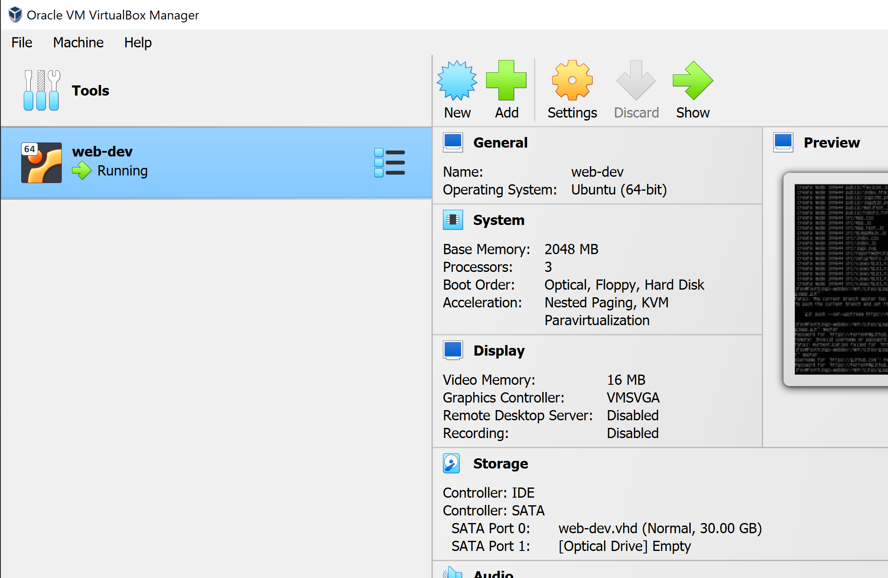

# How does FerrenF develop his react applications?

I run react servers on their own virtual machine using Oracle VM Virtualbox Manager.
You can get that here: https://www.virtualbox.org/wiki/Downloads

Your virtual machine does not need to have a ton of memory or space, and you are free to choose from manu versions of unix.
The above version of Ubuntu is [Ubuntu Server](https://ubuntu.com/download/server). It does not have a UI and is low on resource consumption.

When you set up your virtual machine in Oracle, you'll want to do a few things to make your life easier. You don't want to actually CODE in there do you?

You'll need to set up shared folders so you can access your site directory from within the virtual operating system.
The paths you choose are up to you as long as the repository is initialized in the right place with the right folder name.

Youll also need to set up port forwards so you can access your virtual machine's development server.

Once your machine is set up with the appropriate shared directories and port forwards, you can then proceed to install the few
dependencies needed to run this project: 

[Node.JS](https://nodejs.org/en/download/package-manager)

You'll probably run into more dependencies. It'll let you know.
Once you get that installed, then you should pull from this repository.

When cloning from git into an empty directory,
before anything you will want to run npm-install in the root directory from a console. This does mean that the project will require some version of Node.JS/NPM installed in order to run.

If you are using Node.JS with Windows, or are editing the site directory on the same machine the server runs on, you may
not need WATCHPACK_POLLING=true in the <scripts> section of package.json. This is to make sure that react automatically rebuilds
it's server when files change in an oracle VM shared folder. Otherwise, it will not detect the changes.

# Getting Started with Create React App

This project was bootstrapped with [Create React App](https://github.com/facebook/create-react-app).

## Available Scripts

In the project directory, you can run:

### `npm start`

Runs the app in the development mode.\
Open [http://localhost:3000](http://localhost:3000) to view it in your browser.

The page will reload when you make changes.\
You may also see any lint errors in the console.

### `npm test`

Launches the test runner in the interactive watch mode.\
See the section about [running tests](https://facebook.github.io/create-react-app/docs/running-tests) for more information.

### `npm run build`

Builds the app for production to the `build` folder.\
It correctly bundles React in production mode and optimizes the build for the best performance.

The build is minified and the filenames include the hashes.\
Your app is ready to be deployed!

See the section about [deployment](https://facebook.github.io/create-react-app/docs/deployment) for more information.

### `npm run eject`

**Note: this is a one-way operation. Once you `eject`, you can't go back!**

If you aren't satisfied with the build tool and configuration choices, you can `eject` at any time. This command will remove the single build dependency from your project.

Instead, it will copy all the configuration files and the transitive dependencies (webpack, Babel, ESLint, etc) right into your project so you have full control over them. All of the commands except `eject` will still work, but they will point to the copied scripts so you can tweak them. At this point you're on your own.

You don't have to ever use `eject`. The curated feature set is suitable for small and middle deployments, and you shouldn't feel obligated to use this feature. However we understand that this tool wouldn't be useful if you couldn't customize it when you are ready for it.

## Learn More

You can learn more in the [Create React App documentation](https://facebook.github.io/create-react-app/docs/getting-started).

To learn React, check out the [React documentation](https://reactjs.org/).

### Code Splitting

This section has moved here: [https://facebook.github.io/create-react-app/docs/code-splitting](https://facebook.github.io/create-react-app/docs/code-splitting)

### Analyzing the Bundle Size

This section has moved here: [https://facebook.github.io/create-react-app/docs/analyzing-the-bundle-size](https://facebook.github.io/create-react-app/docs/analyzing-the-bundle-size)

### Making a Progressive Web App

This section has moved here: [https://facebook.github.io/create-react-app/docs/making-a-progressive-web-app](https://facebook.github.io/create-react-app/docs/making-a-progressive-web-app)

### Advanced Configuration

This section has moved here: [https://facebook.github.io/create-react-app/docs/advanced-configuration](https://facebook.github.io/create-react-app/docs/advanced-configuration)

### Deployment

This section has moved here: [https://facebook.github.io/create-react-app/docs/deployment](https://facebook.github.io/create-react-app/docs/deployment)

### `npm run build` fails to minify

This section has moved here: [https://facebook.github.io/create-react-app/docs/troubleshooting#npm-run-build-fails-to-minify](https://facebook.github.io/create-react-app/docs/troubleshooting#npm-run-build-fails-to-minify)
